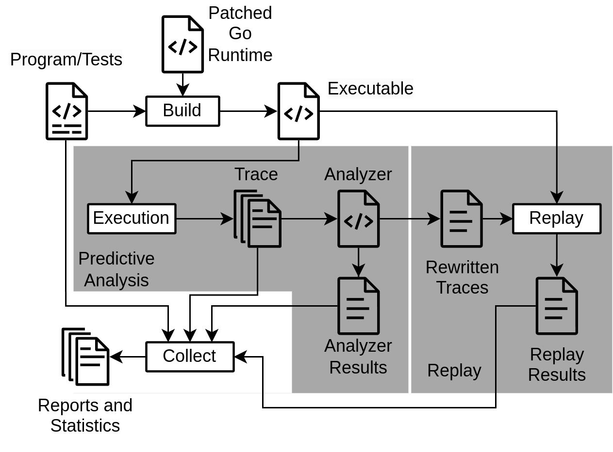

# AdvocateGo
> [!NOTE]
> This program is a work in progress and may result in incorrect or incomplete results.

## What is AdvocateGo
AdvocateGo is an analysis tool for Go programs.
It detects concurrency bugs and gives  diagnostic insight.
This is achieved through `happens-before-relation` and `vector-clocks`

Furthermore it is also able to produce traces which can be fed back into the program in order to experience the predicted bug.

AdvocateGo tries to detect the following situations:
- A01: Send on closed channel
- A02: Receive on closed channel
- A03: Close on closed channel
- A04: Concurrent recv
- A05: Select case without partner
- P01: Possible send on closed channel
- P02: Possible receive on closed channel
- P03: Possible negative waitgroup counter
- P04: Possible unlock of not locked mutex
- L00: Leak on routine without blocking element
- L01: Leak on unbuffered channel with possible partner
- L02: Leak on unbuffered channel without possible partner
- L03: Leak on buffered channel with possible partner
- L04: Leak on buffered channel without possible partner
- L05: Leak on nil channel
- L06: Leak on select with possible partner
- L07: Leak on select without possible partner
- L08: Leak on mutex
- L09: Leak on waitgroup
- L10: Leak on cond

A more in detail explanation of how it works can be found [here](./doc/Analysis.md).
## Usage



### Preparation
Before Advocate can be used, it must first be build.

First you need to build the [analyzer](https://github.com/ErikKassubek/ADVOCATE/tree/main/analyzer)
and if you want to use it the [toolchain](https://github.com/ErikKassubek/ADVOCATE/tree/main/toolchain).
If you do not wish to use the script but to run the step manually, you do not need to build the toolchain.
The two programs are go programs and can just be build using `go build`.

Additionally, the modified go runtime must be build. The runtime can be found in [go-patch](https://github.com/ErikKassubek/ADVOCATE/tree/main/go-patch).
To build it run the
```shell
./src/make.bash
```
or
```shell
./src/make.bat
```
script. This will create a go executable in the `bin` directory.


If you do not wish to use the toolchain script (see below), you must set your
`GOROOT` environment variable to this new runtime:
```shell
export GOROOT=$HOME/ADVOCATE/go-patch/
```
If you use the toolchain script, this will be done automatically.


### Using AdvocateGo with the toolchain scipt
There is a script that will come in handy when working with AdvocateGo.
The script can be found [here](https://github.com/ErikKassubek/ADVOCATE/tree/main/toolchain).

<!-- Currently the script only works for analyzing program using its unit tests.
To analyze programs when running its main function, the steps have to be
performed manually. For this see below in section Manual Analysis. -->

The script is able to analyzer both full programs as well as unit tests.
To automatically run it with full programs, the program must be buildable
with `go build`

It will automatically insert and remove the required headers.
It will run the program or test, analyze it and automatically run rewrites and
replays is possible. It will then create an overview over the found bugs
as well as statistics about

- Overview of predicted bugs
- Overview of expected exit codes (after rewrite)
- Overview of actual exit codes that appeared after running the reordered programs

The script can be run with
```
./toolchain main [args]
```
to run a full program with a main function or with
```
./toolchain tests [args]
```
to run the unit tests.
The following args are required:

- `-a [path]`: path to the ADVOCATE directory
- `-f [path]`: path to the program containing the test files

For main, the following arg is also required

- `-E [name]`: only for main, name of the executable of the program

The following arguments can be set:

- `-t`: if set, the toolchain will measure the runtime of the runs and analysis. It will also run the tests/the program without any recording or replay to measure a base time
- `-m`: if set, the toolchain check if there are relevant operations in the program, that have never been executed in the runs
- `-s`: create a file containing statistics about the program runs

If either `-t` or `-s` is set, the following arg must be set:

- `-N` [name]: name of the analyzed program


Its result and additional information (rewritten traces, logs, etc) will be written to `advocateResult`.


### Using AdvocateGo with Manual Analysis
<!-- These steps can also be done automatically with scripts. If you want to know more about using them you can skip straight to the [Tooling](#tooling) section. -->
To run the analysis manual, you need to perform the following steps:
#### Step 1: Add Overhead
You need to adjust the main method or unit test you want to analyze slightly in order to analyze them.
The code snippet you need is
```go
import "advocate"
...
// ======= Preamble Start =======
    advocate.InitTracing()
    defer advocate.FinishTracing()
// ======= Preamble End =======
...
```
Eg. like this
```go
import "advocate"
func main(){
    // ======= Preamble Start =======
    advocate.InitTracing()
    defer advocate.FinishTracing()
    // ======= Preamble End =======
...
}
```
or like this for a unit test
```go
import "advocate"
...
func TestImportantThings(t *testing.T){
    // ======= Preamble Start =======
    advocate.InitTracing()
    defer advocate.FinishTracing()
    // ======= Preamble End =======
...
}
```

#### Step 2: Run your go program
Now you can finally run your go program with the binary that was build in the preparation step.
It is located under `./go-patch/bin/go`
Eg. like so
```shell
./go-patch/bin/go run main.go
```
or like this for your tests
```shell
./go-patch/bin/go test
```
#### Step 3: Analyzing Traces
After you run your program you will find that it generated the folder `advocateTrace`.
If you are curious about the structure of said trace, you can find an in depth explanation [here](./doc/Trace.md)
It contains a record of what operation ran in what thread during the execution of your program.

This acts as input for the analyzer located under `./analyzer/analyzer`.
It can be run like so
```shell
./analyzer/analyzer -t advocateTrace
```
#### Output
Running the analyzer will generate 3 files for you
- machine_readable.log (good for parsing and further analysis)
- human readable.log (more readable representation of bug predictions)
- rewritten_Trace (a trace in which the bug it was rewritten for would occur)

A more detailed explanation of the file contents can be found under [AnalysisResult.md](./doc/AnalysisResult.md)


#### Step 4: Replay
For some of the bugs, the analyzer will create rewritten traces, that may
contain the bug. If run, they could lead to the program crashing or in the case
of leaks to run could resolve the leak. This can be used to confirm a reported
bug.

This process is similar to when we first ran the program. Only the Overhead changes slightly.

Instead want to use this overhead

```go
// ======= Preamble Start =======
advocate.InitReplay("n", true, m, true)
defer advocate.FinishReplay()
// ======= Preamble End =======
```

The variable `n` is the rewritten trace you want to use (to replay the recording, set `n=0`, for the rewritten trace `rewritten_trace_1` set `n=1`)\
`m` is a timeout in second (to disable timeout set `m=0`).\
The replay will end with one of the following error codes:
```
0:  "The replay terminated without finding a Replay element",
3:  "The program panicked unexpectedly",
10: "Timeout",
20: "Leak: Leaking unbuffered channel or select was unstuck",
21: "Leak: Leaking buffered channel was unstuck",
22: "Leak: Leaking Mutex was unstuck",
23: "Leak: Leaking Cond was unstuck",
24: "Leak: Leaking WaitGroup was unstuck",
30: "Send on close",
31: "Receive on close",
32: "Negative WaitGroup counter",
33: "Unlock of unlocked mutex",
```
If you do not want an error code, you can set the first `true` in the arguments to `false`.\
The replay will also perform the atomic operations in the order of the trace. This has the advantage, that the replay is less likely to fail, but it increases the runtime significantly. If you do not want that the atomics are also replayed in the order of the trace, you can set the second `true` to `false`.


Note that the method looks for the `rewritten_trace` folder in the same directory as the file is located

To replay and at the same time record a new trace, you can add the following header
```go
// ======= Preamble Start =======
advocate.InitReplayTracing("n", false, m, true)
defer advocate.FinishReplayTracing()
// ======= Preamble End =======
```
The arguments are the same as in `advocate.InitReplay`. \
Here it is advisable to set the first bool to `false`.\
Changing the second bool to false will only effect the replay, but not the recording of the atomics.\
If `n` is set to `-1`, no replay will be done. It is therefore equivalent to
```go
// ======= Preamble Start =======
advocate.InitTracing()
defer advocate.FinishTracing()
// ======= Preamble End =======
```
The replay and tracing at the same time is not yet implemented in the toolchain.


A more detailed description of how replays work and a list of what bugs are currently supported for replay can be found under [TraceReplay.md](./doc/TraceReplay.md) and [TraceReconstruciton.md](./doc/TraceReconstruction.md).


<!-- Likewise [main overhead remover](./toolchain/overHeadRemover/remover.go) will remove the overhead
#### For Unit Tests
[Unit test overhead inserter]() additionally requires the test name you want to apply the overhead to. Apart from that it works just like with [main method overhead inserter](#for-main-methods)

Likewise [overhead remover](./toolchain/overHeadRemover/remover.go) will remove the overhead if is present.
### Analyzing an existing local project
#### Main Method
[runFullWorkflowOnMain.bash](./toolchain/runFullWorkflowMainMethod/runFullWorkflowMain.bash) accepts a single go file containing a main method automatically runs the analysis + replay on all unit tests. After running you will additionally get a csv file that lists all predicted and confirmed bugs. (ongoing)

Its result and additional information (rewritten traces, logs, etc) will be written to. `advocateResult`

#### Unit Tests
[runFullWorkflowOnAllUnitTests.bash](./toolchain/runFullWorkflowOnAllUnitTests/runFullWorkflowOnAllUnitTests.bash) takes an entire project and automatically runs the analysis + replay on all unit tests. After running you will additionally get a csv file that lists all predicted and confirmed bugs. (ongoing)

Its result and additional information (rewritten traces, logs, etc) will be written to. `advocateResult` -->
<!-- ## Generate Statistics
After analyzing you can evaluate your `advocateResult` folder with [generateStatistics.go](./toolchain/generateStatisticsFromAdvocateResult/generateStatistics.go). It will provide following information.
- Overview of predicted bugs
- Overview of expected exit codes (after rewrite)
- Overview of actual exit codes that appeared after running the reordered programs -->

## Warning
It is the users responsibility of the user to make sure, that the input to
the program, including e.g. API calls are equal for the recording and the
tracing. Otherwise the replay is likely to get stuck.

Do not change the program code between trace recording and replay. The identification of the operations is based on the file names and lines, where the operations occur. If they get changed, the program will most likely block without terminating. If you need to change the program, you must either rerun the trace recording or change the effected trace elements in the recorded trace.
This also includes the adding of the replay header. Make sure, that it is already in the program (but commented out), when you run the recording.
